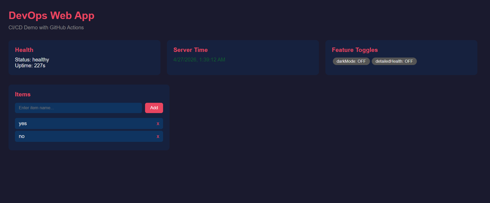
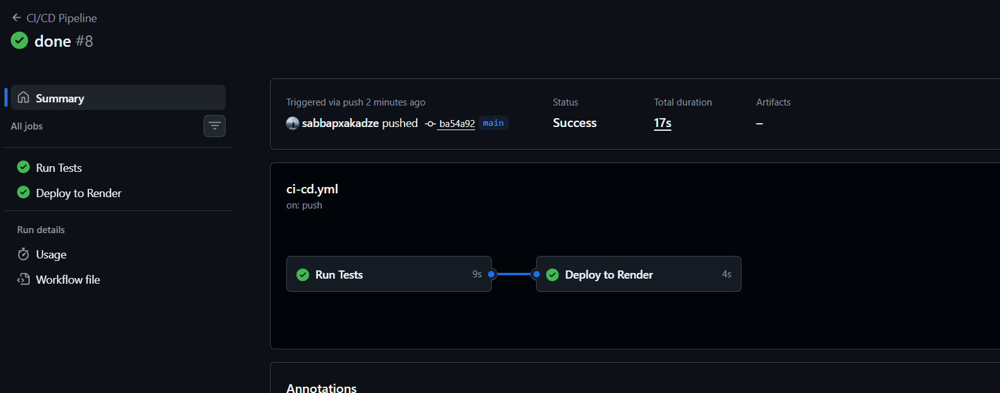

# DevOps Web App


A Node.js/Express web application demonstrating a full CI/CD pipeline with GitHub Actions, automated testing, and continuous deployment to Render.

---

## Live Application

**URL:** https://project-x8v8.onrender.com

---

## Screenshots

### Hosted Application


### Successful GitHub Actions Run


---

## Quick Start (Local)

```bash
npm install
npm start
```

Visit http://localhost:3000

```bash
npm test
```

---

## API Endpoints

| Endpoint | Method | Description |
|---|---|---|
| `/` | GET | Web UI |
| `/health` | GET | Health check |
| `/features` | GET | Feature toggle status |
| `/metrics` | GET | Prometheus-format metrics |
| `/time` | GET | Current server time |
| `/items` | GET | List all items |
| `/items` | POST | Create an item |
| `/items/:id` | DELETE | Delete an item |

---

## CI/CD Pipeline

### How It Works

The pipeline is defined in `.github/workflows/ci-cd.yml` and has two jobs:

```
push to main
     │
     ▼
┌─────────┐     fail → pipeline stops, no deploy
│  test   │ ──────────────────────────────────────►  ✗
└─────────┘
     │ pass
     ▼
┌──────────┐
│  deploy  │ ──► triggers Render deploy hook ──► live app updated
└──────────┘
```

**Job 1 — `test` (runs on every push and pull request)**
- Checks out the code
- Installs Node.js 20 and runs `npm ci`
- Runs the full Jest test suite (`npm test`)
- If any test fails, the job fails and the pipeline stops — the `deploy` job never runs

**Job 2 — `deploy` (runs only on push to `main`, only if `test` passed)**
- Sends an HTTP POST to the Render deploy hook URL (stored as `RENDER_DEPLOY_HOOK_URL` in GitHub Secrets)
- Render receives the hook and starts deploying the latest commit
- No manual intervention required

This enforces the rule: **broken code can never reach production.**

---

## Deployment Strategy — Recreate

### Why Recreate?

The **Recreate** strategy was chosen because it is the most straightforward and transparent approach for a single-instance free-tier deployment.

### How It Works

1. When a deploy is triggered, Render stops the currently running instance
2. Render pulls the latest code from the `main` branch
3. It runs `npm install` and starts the new instance with `npm start`
4. Once the new instance passes its health check, traffic is routed to it

### Trade-offs

| Aspect | Detail |
|---|---|
| Downtime | ~10–30 seconds during the switch |
| Simplicity | Very easy to reason about — one version runs at a time |
| Risk | If the new deploy fails its health check, Render surfaces the error and the hook fails |
| Free-tier fit | No extra services or instances required |

For a production system with zero-downtime requirements a **Rolling Update** or **Blue-Green** strategy would be used, but those require multiple running instances which are not available on the free tier.

---

## Rollback Guide

If a bad deployment reaches production, follow these steps to revert.

### Option A — Rollback via Render Dashboard (Fastest)

1. Go to [dashboard.render.com](https://dashboard.render.com) and open your Web Service
2. Click the **"Events"** tab on the left sidebar
3. Find the last known good deploy in the list
4. Click the three-dot menu (`...`) next to it and select **"Rollback to this deploy"**
5. Render immediately redeploys that exact build — no code change needed
6. Monitor the **"Logs"** tab to confirm the old version is running

### Option B — Git Revert + Push (Auditable)

Use this when you want a permanent record of the rollback in git history.

```bash
# 1. Find the commit hash of the last good version
git log --oneline

# 2. Revert the bad commit (creates a new commit that undoes it)
git revert <bad-commit-hash>

# 3. Push to main — this triggers the CI/CD pipeline automatically
git push origin main
```

The pipeline will run tests on the reverted code, and if they pass, deploy the rollback automatically.

### Option C — Hard Reset (Emergency Only)

Only use this if Option B is not viable. This rewrites history.

```bash
git reset --hard <last-good-commit-hash>
git push --force origin main
```

> **Warning:** force-pushing rewrites the remote history. Coordinate with your team before doing this.
